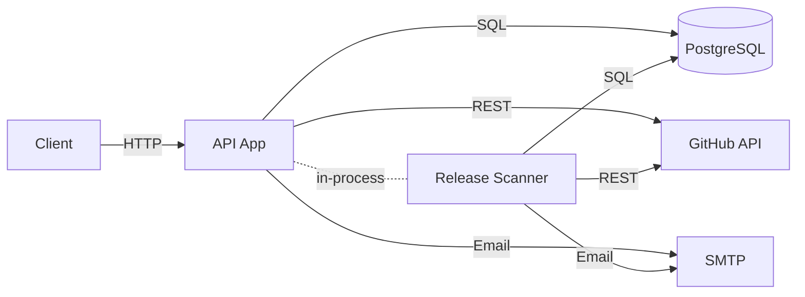
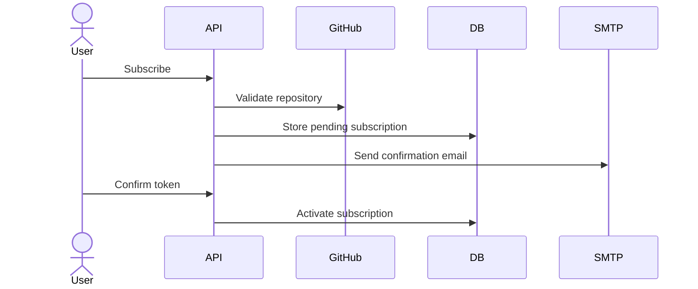
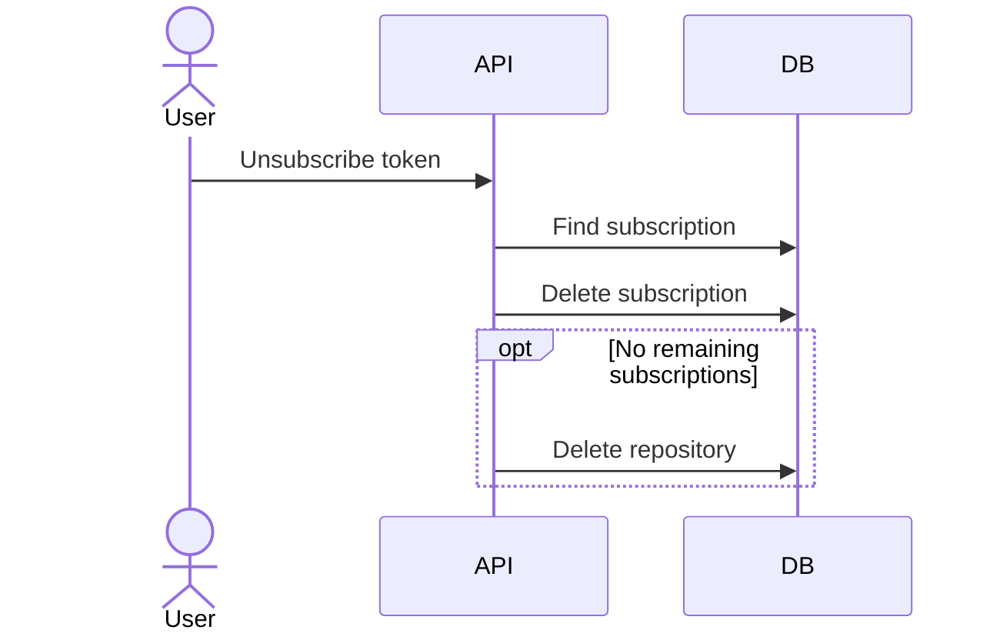
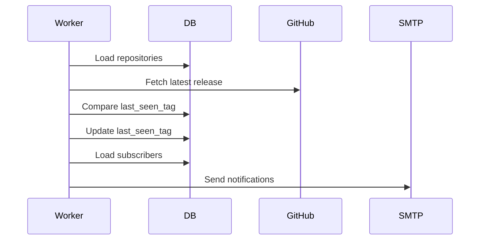

# System Design Document

## 1. Overview
This project is a Go monolith that lets users subscribe to GitHub repository release notifications by email. A user subscribes with an email and repository name, confirms the subscription through a tokenized link, and then receives notifications when the system detects a new release.

## 2. Context and Problem
The problem is to provide a simple service that tracks GitHub repository releases and notifies interested users by email. Without such a service, users must manually check repositories for new releases.

The original task defined several important constraints that shaped the system design:
- the whole solution must be implemented as a single service
- all application state must be stored in a database
- repository existence must be validated through the GitHub API
- release detection must happen through periodic background scanning
- users must confirm subscriptions and be able to unsubscribe safely

The current implementation keeps that shape: one Go service contains the HTTP API, business logic, database access, GitHub integration, mail sending, and background worker.

## 3. Requirements
### Functional Requirements
- Allow clients to create subscriptions for GitHub repositories in `owner/repo` format
- Validate email input and repository format before creating a subscription
- Verify repository existence through the GitHub API before persisting a subscription
- Require `Authorization: Bearer <API_KEY>` for `POST /api/subscribe` and `GET /api/subscriptions` when the `API_KEY` environment variable is set
- Create pending subscriptions with confirmation and unsubscribe tokens, confirm them, list them by email, and remove them through unsubscribe token
- Run schema migrations automatically on service startup
- Periodically scan tracked repositories for releases in the background
- Detect genuinely new releases and avoid repeated notifications for unchanged release tags
- Send confirmation emails for new subscriptions
- Send release notification emails only to confirmed subscribers when a new release is detected

### Non-Functional Requirements
- Keep the architecture as a monolith
- Preserve the REST contract defined in `swagger.yaml`
- Use the database as the source of truth for subscriptions and repository tracking state
- Handle GitHub `404` and `429` responses correctly
- Keep confirmation and unsubscribe flows safe through persisted tokens

## 4. High-Level Architecture
The system consists of four main runtime parts:
- Go API service that also runs the background worker in the same process
- PostgreSQL database for subscriptions and repository state
- GitHub REST API for repository validation and release checks
- SMTP server for confirmation and notification emails

High-level runtime flow:
1. Client sends an HTTP request to the API
2. Router applies middleware and forwards the request to the service layer
3. Service layer validates input, coordinates persistence, and calls GitHub or mail integrations when needed
4. PostgreSQL stores subscription and repository tracking state
5. The in-process worker periodically checks GitHub releases and triggers notifications

## 5. Main Components
- HTTP layer: handles routing, request parsing, response writing, and middleware. If `API_KEY` is configured, `POST /api/subscribe` and `GET /api/subscriptions` require `Authorization: Bearer <API_KEY>`.
- Service layer: owns subscription lifecycle, repository reuse/creation, token handling, unsubscribe cleanup, and orchestration of persistence plus integrations
- Store layer: performs database operations for subscriptions and repositories
- GitHub client: validates repositories and fetches release data
- Mail service: sends confirmation and release emails synchronously through SMTP
- Background worker: scans repositories, detects new releases through shared repository state, and triggers notifications for confirmed subscriptions

## 6. Key Workflows
### Subscribe and Confirm Flow

1. Client sends `POST /api/subscribe`
2. Router enforces API-key middleware if `API_KEY` is configured
3. API validates input and repository format
4. GitHub client verifies repository existence
5. Service creates or finds repository state
6. Service stores a pending subscription with confirmation token
7. Mail service sends the confirmation email synchronously
8. Client opens `GET /api/confirm/{token}`
9. Service resolves the confirmation token and marks the subscription as confirmed
10. Unknown confirmation tokens return an invalid-token response
11. Confirmation tokens currently do not expire and are not consumed after confirmation, so confirming an already confirmed subscription is idempotent

### Unsubscribe Flow

1. Client opens `GET /api/unsubscribe/{token}`
2. Service resolves unsubscribe token
3. Subscription is deleted
4. If the token is unknown or already used, the API returns an invalid-token response
5. Unsubscribe tokens currently do not expire, but they become unusable after the subscription is deleted
6. If no subscriptions remain for that repository, the orphaned repository record is deleted
7. Deleting the repository avoids tracking repositories with no subscribers. If someone subscribes later, the repository is validated and created again.

### Release Scan and Notify Flow

1. Worker wakes up on interval
2. Worker loads tracked repositories from the database
3. Worker processes repositories concurrently with bounded parallelism
4. Worker fetches latest release data from GitHub
5. Worker compares the latest tag against stored `last_seen_tag`
6. If a release is new, repository state is updated with the new `last_seen_tag`
7. Worker loads affected confirmed subscriptions
8. Mail service sends notifications synchronously for each confirmed subscriber
9. The worker updates `last_seen_tag` before sending emails, so the current behavior is at-most-once notification attempts per release, not guaranteed delivery
10. Per-repository failures are isolated and logged without stopping the whole scan
11. If GitHub rate limit is hit, the current scan pass is canceled and resumed on the next interval

## 7. Data and Persistence
The design stores two main kinds of state:
- subscription state
  - email
  - repository reference
  - confirmation token
  - unsubscribe token
  - confirmation status
- repository state
  - repository name
  - `last_seen_tag`
  - `created_at`
  - `updated_at`

Important persistence notes:
- Multiple subscriptions can reference the same repository record, so repository-level state such as `last_seen_tag` is stored once and shared across subscribers.
- Repository identity is enforced by a unique repository name, and subscription identity is enforced by a uniqueness constraint on `(email, repository_id)`.
- Confirmation and unsubscribe tokens are persisted and individually unique.
- Repository creation follows a find-or-create pattern with conflict recovery in the service layer, because repository uniqueness is enforced by the database and concurrent subscribe requests may race.
- Token generation may retry on uniqueness conflicts, because token uniqueness is also enforced by persistence constraints.
- When a subscription is deleted, the service checks whether that repository still has any remaining subscriptions. If not, the repository row is deleted as an orphaned record.
- Indexes support common lookup paths such as email, confirmation token, and unsubscribe token.

## 8. External Integrations and Failure Handling
### GitHub API
- used to validate repositories during subscribe flow
- used to fetch latest release information during scans
- `404` is handled differently depending on the flow: repository creation rejects unknown repositories, while scanning skips repositories that do not currently produce latest release data
- `429` causes the current scan pass to stop early and resume on the next interval
- temporary network failures are logged and isolated so one repository failure does not break the whole scan

### SMTP
- used for confirmation emails and release notifications
- confirmation emails are sent synchronously during subscription creation, so a delivery failure makes the subscribe request fail after the pending subscription has already been stored
- release notification emails are sent synchronously by the worker, and per-recipient send failures are logged without stopping the rest of the scan

### Database
- stores all application state
- migrations run on startup
- uniqueness constraints and indexes protect lifecycle and lookup invariants

## 9. Tradeoffs and Future Evolution
Current design tradeoffs:
- monolith instead of multiple services: lower operational complexity and simpler local development, but the HTTP API and background worker are deployed and scaled together
- polling instead of webhooks: works for arbitrary public repositories without admin access, but notifications are delayed by scan interval and constrained by GitHub rate limits
- shared repository state: avoids duplicate release checks and duplicated `last_seen_tag` values, but requires joins, concurrent find-or-create handling, and orphan cleanup

Possible future improvements:
- caching for GitHub requests
- stronger retry/backoff strategy
- metrics and observability
- more mature deployment and CI/CD workflows

## 10. Related ADRs
Current ADRs:
- `ADR-0001: Use pgx for PostgreSQL access`
- `ADR-0002: Poll GitHub API to detect new releases`
- `ADR-0003: Model repositories separately from subscriptions`
