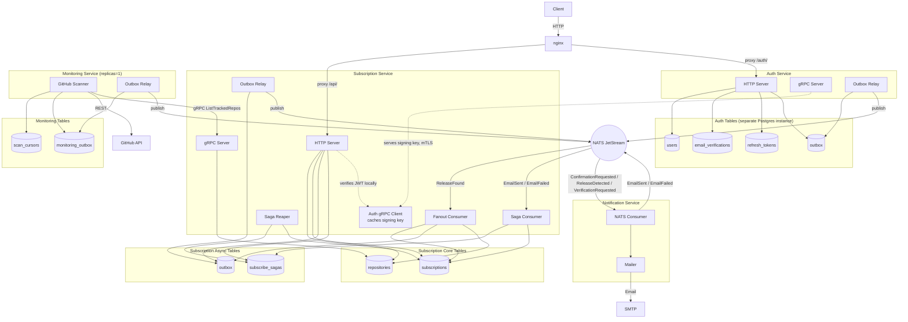
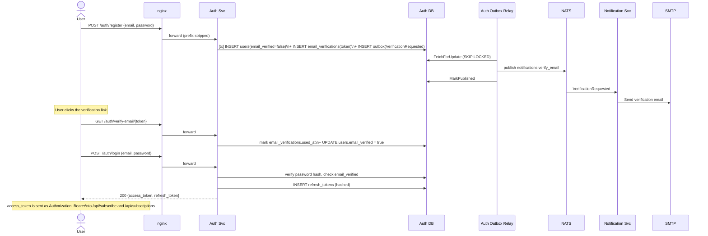
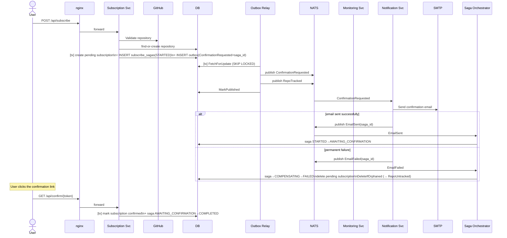
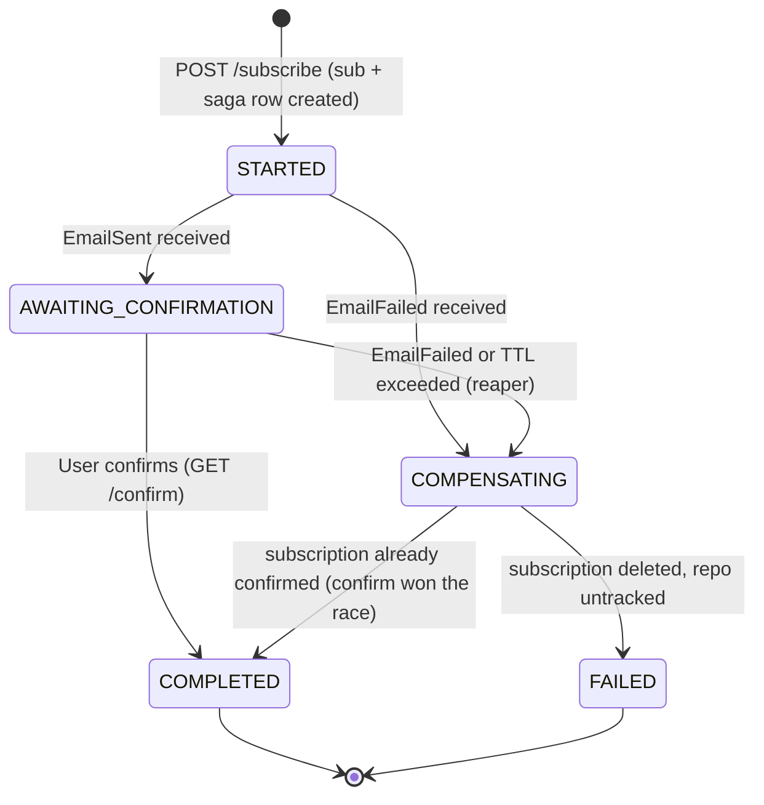
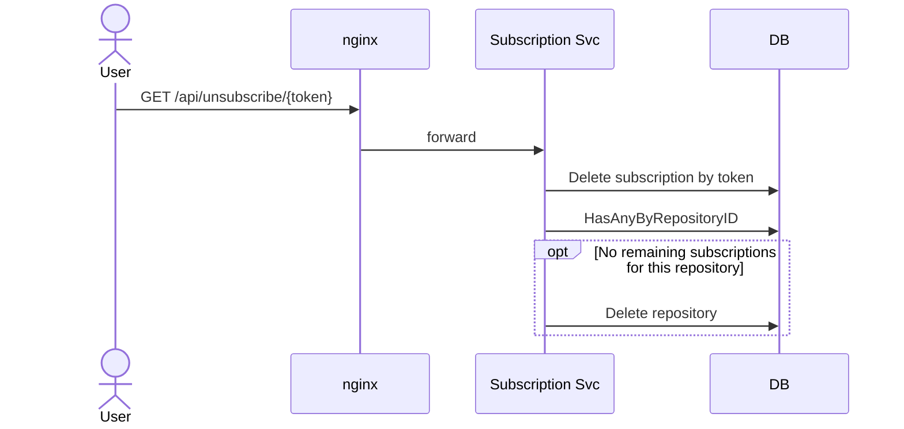
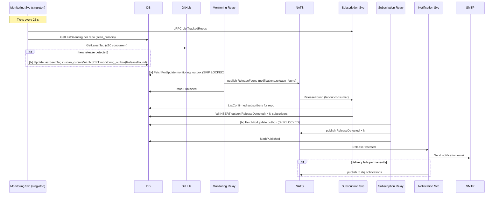
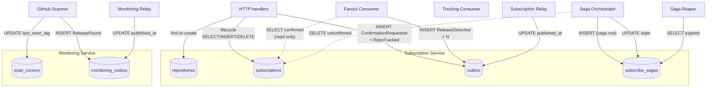

# System Design Document

## 1. Overview
This project is a GitHub release notification system built as four independently deployable Go services. Users register an account and verify it by email, subscribe that account to a GitHub repository, confirm the subscription through a tokenized link, and receive notifications when the system detects a new release. The services communicate asynchronously through NATS JetStream; Subscription verifies user identity via JWTs issued by the Auth service.

## 2. Context and Problem
The problem is to notify users by email when a GitHub repository publishes a new release. Without such a service, users must manually check repositories.

Original constraints that shaped the initial design:
- all application state must be stored in a database
- repository existence must be validated through the GitHub API
- release detection must happen through periodic background scanning
- users must confirm subscriptions and be able to unsubscribe safely

The system evolved from a monolith in five phases:
- **Phase 1** — Extracted the monitoring worker into its own deployable (`services/monitoring`)
- **Phase 2** — Monitoring became fully event-driven: owns `scan_cursors` + `monitoring_outbox`, emits `ReleaseFound` via its own outbox relay
- **Phase 3** — Dissolved the monolith: renamed to `services/subscription`, wired nginx to the new service name
- **Phase 4** — Monitoring switched from NATS tracking events to a gRPC `CatalogService` call on the subscription service for the repo list; `RepoTracked`/`RepoUntracked` events and the `TRACKING` stream removed
- **Phase 5** — Extracted account management into `services/auth`: registration, email verification, login, and JWT issuance. Subscription dropped the static `API_KEY` guard in favor of verifying JWTs locally (ES256), fetching Auth's public signing key once over mTLS gRPC. Auth runs against its own Postgres instance so password hashes stay in a separate failure/backup domain from subscription data.

## 3. Requirements
### Functional Requirements
- Allow users to register an account (email + password), verify the email via a tokenized link, and log in to receive a JWT access/refresh token pair
- Block login until the account's email is verified
- Allow clients to create subscriptions for GitHub repositories in `owner/repo` format
- Validate email input and repository format before creating a subscription
- Verify repository existence through the GitHub API before persisting a subscription
- Require a valid JWT (`Authorization: Bearer <token>`) for `POST /api/subscribe` and `GET /api/subscriptions`; the subscriber's email comes from the token's `email` claim, not the request
- Create pending subscriptions with confirmation and unsubscribe tokens, confirm them, list them by the authenticated user's email, and remove them through unsubscribe token
- Run schema migrations automatically on service startup (each service runs its own migrations)
- Periodically scan tracked repositories for releases in the background
- Detect genuinely new releases and avoid repeated notifications for unchanged release tags
- Send confirmation emails for new subscriptions
- Send release notification emails only to confirmed subscribers when a new release is detected

### Non-Functional Requirements
- Preserve the REST contract defined in `swagger.yaml`
- Use the database as the source of truth for subscriptions and repository tracking state
- Handle GitHub `404` and `429` responses correctly
- Keep confirmation and unsubscribe flows safe through persisted tokens
- Monitoring must run as a single replica to avoid duplicate GitHub polling
- Subscription and Notification services are horizontally scalable

## 4. High-Level Architecture

Four services, one nginx edge, one NATS broker, two PostgreSQL instances (Auth has its own):

```mermaid
flowchart TB
    Client[Client] -->|HTTP| nginx[nginx]
    nginx -->|proxy /api/| HTTP
    nginx -->|proxy /auth/| AuthHTTP

    subgraph auth["Auth Service"]
        direction TB
        AuthHTTP[HTTP Server]
        AuthGRPC[gRPC Server]
        AuthRelay[Outbox Relay]
    end

    subgraph subscription["Subscription Service"]
        direction TB
        HTTP[HTTP Server]
        GRPC[gRPC Server]
        FW[Fanout Consumer]
        Relay1[Outbox Relay]
        SagaCons[Saga Consumer]
        SagaReaper[Saga Reaper]
        AuthClient[Auth gRPC Client\ncaches signing key]
    end

    subgraph monitoring["Monitoring Service (replicas=1)"]
        direction TB
        Scanner[GitHub Scanner]
        Relay2[Outbox Relay]
    end

    subgraph notification["Notification Service"]
        direction TB
        NotifConsumer[NATS Consumer]
        Mailer[Mailer]
    end

    subgraph authdb["Auth Tables (separate Postgres instance)"]
        direction LR
        users[(users)]
        verif[(email_verifications)]
        refresh[(refresh_tokens)]
        authoutbox[(outbox)]
    end

    subgraph subcore["Subscription Core Tables"]
        direction LR
        repos[(repositories)]
        subs[(subscriptions)]
    end

    subgraph subasync["Subscription Async Tables"]
        direction LR
        outboxt[(outbox)]
        sagas[(subscribe_sagas)]
    end

    subgraph mondb["Monitoring Tables"]
        direction LR
        cursors[(scan_cursors)]
        monoutbox[(monitoring_outbox)]
    end

    NATS((NATS JetStream))
    GitHub[GitHub API]
    SMTP[SMTP]

    %% Auth service → its tables
    AuthHTTP --> users & verif & refresh & authoutbox
    AuthRelay --> authoutbox
    AuthGRPC -.->|serves signing key, mTLS| AuthClient

    %% Subscription service → its tables
    HTTP --> repos & subs & outboxt & sagas
    HTTP -.->|verifies JWT locally| AuthClient
    GRPC --> repos
    FW --> subs & outboxt & repos
    Relay1 --> outboxt
    SagaCons --> sagas & subs
    SagaReaper --> sagas & subs

    %% Monitoring service → its tables + external
    Scanner --> cursors & monoutbox
    Relay2 --> monoutbox
    Scanner -->|REST| GitHub
    Scanner -->|gRPC ListTrackedRepos| GRPC

    %% NATS event bus
    AuthRelay -->|publish| NATS
    Relay1 -->|publish| NATS
    Relay2 -->|publish| NATS
    NATS -->|ReleaseFound| FW
    NATS -->|ConfirmationRequested / ReleaseDetected / VerificationRequested| NotifConsumer
    NATS -->|EmailSent / EmailFailed| SagaCons

    %% Notification service
    NotifConsumer --> Mailer -->|Email| SMTP
    NotifConsumer -->|EmailSent / EmailFailed| NATS
```

### NATS Streams

| Stream | Subjects | Retention | Producer | Consumer |
|---|---|---|---|---|
| `NOTIFICATIONS` | `notifications.>` | WorkQueue | Auth relay, Subscription relay, Monitoring relay | Notification svc, Subscription fanout |
| `NOTIFICATIONS_DLQ` | `dlq.notifications` | Limits | Notification svc | — |
| `SAGA` | `saga.>` | Limits | Notification svc | Subscription saga consumer |

### Event subjects

| Subject | Emitted by | Consumed by | Description |
|---|---|---|---|
| `notifications.verify_email` | Auth | Notification | Email-verification link for a new registration |
| `notifications.confirmation` | Subscription | Notification | Email confirmation link (carries `saga_id`) |
| `notifications.release` | Subscription | Notification | Per-recipient release email |
| `notifications.release_found` | Monitoring | Subscription | Repo-level new release event |
| `dlq.notifications` | Notification | — | Undeliverable events |
| `saga.email.sent` | Notification | Subscription saga | Confirmation email delivered successfully |
| `saga.email.failed` | Notification | Subscription saga | Confirmation email permanently undeliverable |

## 5. Main Components

### Auth Service (`services/auth`)
Owns account registration, email verification, login, and JWT issuance, against its own Postgres instance. `POST /register` creates an unverified user and writes a `VerificationRequested` outbox entry in the same transaction. `GET /verify-email/{token}` flips `users.email_verified`. `POST /login` is rejected with 401 until the email is verified; on success it issues an ES256 JWT access token (claims: `sub`, `email`, `iat`, `exp`; 15-minute default TTL) plus an opaque, sha256-hashed refresh token (30-day default TTL, single-use — rotated on every `/refresh` call). Exposes a gRPC `GetSigningKey` method (mTLS) that returns the current public signing key PEM + `kid`, which Subscription fetches once at startup and refreshes every 15 minutes to verify JWTs locally without a runtime call to Auth.

### Subscription Service (`services/subscription`)
Owns the REST API, subscription lifecycle, fan-out, and the subscribe saga orchestrator. Verifies the caller's JWT locally (ES256, against the cached Auth signing key) on `POST /subscribe` and `GET /subscriptions`; the subscriber's email comes from the token's `email` claim, not the request. On subscribe, writes a pending subscription, a saga row, and a `ConfirmationRequested` outbox entry in a single transaction. Runs the fanout NATS consumer: receives `ReleaseFound`, lists confirmed subscribers, and inserts per-recipient `ReleaseDetected` outbox rows in a single transaction. Also runs the saga reply consumer and a TTL reaper (see Subscribe Saga below). Exposes a gRPC `CatalogService` that returns all tracked repositories to the monitoring service.

### Monitoring Service (`services/monitoring`, `replicas: 1`)
Owns GitHub scanning and release detection. On each tick, calls the subscription service's gRPC `CatalogService.ListTrackedRepos` to get the current repo list, then reads each repo's `last_seen_tag` from its local `scan_cursors` table. Scans up to 10 repos concurrently against GitHub. On a new tag, atomically advances the cursor and inserts `ReleaseFound` into `monitoring_outbox` in a single transaction. The outbox relay publishes to NATS.

### Notification Service (`services/notification`)
Stateless email sender. Consumes `ConfirmationRequested` and `ReleaseDetected` from the `NOTIFICATIONS` stream. Renders and delivers via SMTP. On transient SMTP failure, NAKs so the message is redelivered. On unmarshal failure, terminates the message and writes to the DLQ stream.

### Transactional Outbox
Auth, Subscription, and Monitoring all use the same pattern: state changes and "intent to publish" are committed in one database transaction. A relay goroutine polls for unpublished rows with `FOR UPDATE SKIP LOCKED`, publishes to NATS with a stable `Msg-Id` header for server-side deduplication, and marks rows published. This provides at-least-once delivery with bounded duplication, with no event loss on process restart.

### Subscribe Saga Orchestrator
A coordinated (orchestration-based) saga that drives the subscribe workflow as a recoverable multi-step transaction. Saga state is persisted in `subscribe_sagas`. Three goroutines handle it: the outbox relay (publishes the initial events), the saga reply consumer (processes `EmailSent`/`EmailFailed` from NATS), and the reaper (polls for expired sagas every 30 s). See section 6 for the full flow.

### nginx
Edge proxy. Routes `/api/` to the Subscription service and `/auth/` to the Auth service (prefix stripped). Serves the built frontend SPA as static assets from its document root.

## 6. Key Workflows

### Register, Verify, and Log In

```mermaid
sequenceDiagram
    actor User
    participant nginx
    participant AuthSvc as Auth Svc
    participant DB as Auth DB
    participant Relay as Auth Outbox Relay
    participant NATS
    participant Notif as Notification Svc
    participant SMTP

    User->>nginx: POST /auth/register {email, password}
    nginx->>AuthSvc: forward (prefix stripped)
    AuthSvc->>DB: [tx] INSERT users(email_verified=false)\n+ INSERT email_verifications(token)\n+ INSERT outbox(VerificationRequested)
    Relay->>DB: FetchForUpdate (SKIP LOCKED)
    Relay->>NATS: publish notifications.verify_email
    Relay->>DB: MarkPublished
    NATS->>Notif: VerificationRequested
    Notif->>SMTP: Send verification email

    Note over User: User clicks the verification link
    User->>nginx: GET /auth/verify-email/{token}
    nginx->>AuthSvc: forward
    AuthSvc->>DB: mark email_verifications.used_at\n+ UPDATE users.email_verified = true

    User->>nginx: POST /auth/login {email, password}
    nginx->>AuthSvc: forward
    AuthSvc->>DB: verify password hash, check email_verified
    AuthSvc->>DB: INSERT refresh_tokens (hashed)
    AuthSvc-->>User: 200 {access_token, refresh_token}

    Note over User: access_token is sent as Authorization: Bearer\nto /api/subscribe and /api/subscriptions
```

### Subscribe and Confirm Flow (with Saga)

```mermaid
sequenceDiagram
    actor User
    participant nginx
    participant Sub as Subscription Svc
    participant GitHub
    participant DB
    participant Relay as Outbox Relay
    participant NATS
    participant Mon as Monitoring Svc
    participant Notif as Notification Svc
    participant SMTP
    participant Saga as Saga Orchestrator

    User->>nginx: POST /api/subscribe
    nginx->>Sub: forward
    Sub->>GitHub: Validate repository
    Sub->>DB: find-or-create repository
    Sub->>DB: [tx] create pending subscription\n+ INSERT subscribe_sagas(STARTED)\n+ INSERT outbox(ConfirmationRequested+saga_id)

    Relay->>DB: [tx] FetchForUpdate (SKIP LOCKED)
    Relay->>NATS: publish ConfirmationRequested
    Relay->>NATS: publish RepoTracked
    Relay->>DB: MarkPublished

    NATS->>Notif: ConfirmationRequested
    Notif->>SMTP: Send confirmation email
    alt email sent successfully
        Notif->>NATS: publish EmailSent(saga_id)
        NATS->>Saga: EmailSent
        Saga->>DB: saga STARTED→AWAITING_CONFIRMATION
    else permanent failure
        Notif->>NATS: publish EmailFailed(saga_id)
        NATS->>Saga: EmailFailed
        Saga->>DB: saga→COMPENSATING→FAILED\ndelete pending subscription\nDeleteIfOrphaned (→ RepoUntracked)
    end

    Note over User: User clicks the confirmation link
    User->>nginx: GET /api/confirm/{token}
    nginx->>Sub: forward
    Sub->>DB: [tx] mark subscription confirmed\n+ saga AWAITING_CONFIRMATION→COMPLETED
```

### Subscribe Saga State Machine

```mermaid
stateDiagram-v2
    [*] --> STARTED : POST /subscribe (sub + saga row created)
    STARTED --> AWAITING_CONFIRMATION : EmailSent received
    STARTED --> COMPENSATING : EmailFailed received
    AWAITING_CONFIRMATION --> COMPLETED : User confirms (GET /confirm)
    AWAITING_CONFIRMATION --> COMPENSATING : EmailFailed or TTL exceeded (reaper)
    COMPENSATING --> FAILED : subscription deleted, repo untracked
    COMPENSATING --> COMPLETED : subscription already confirmed (confirm won the race)
    COMPLETED --> [*]
    FAILED --> [*]
```

### Unsubscribe Flow

```mermaid
sequenceDiagram
    actor User
    participant nginx
    participant Sub as Subscription Svc
    participant DB

    User->>nginx: GET /api/unsubscribe/{token}
    nginx->>Sub: forward
    Sub->>DB: Delete subscription by token
    Sub->>DB: HasAnyByRepositoryID
    opt No remaining subscriptions for this repository
        Sub->>DB: Delete repository
    end
```

### Release Scan and Notify Flow

```mermaid
sequenceDiagram
    participant Mon as Monitoring Svc (singleton)
    participant DB
    participant GitHub
    participant Relay2 as Monitoring Relay
    participant NATS
    participant Sub as Subscription Svc
    participant Relay1 as Subscription Relay
    participant Notif as Notification Svc
    participant SMTP

    Note over Mon: Ticks every 25 s
    Mon->>Sub: gRPC ListTrackedRepos
    Mon->>DB: GetLastSeenTag per repo (scan_cursors)
    Mon->>GitHub: GetLatestTag (≤10 concurrent)
    alt new release detected
        Mon->>DB: [tx] UpdateLastSeenTag in scan_cursors\n+ INSERT monitoring_outbox(ReleaseFound)
    end

    Relay2->>DB: [tx] FetchForUpdate monitoring_outbox (SKIP LOCKED)
    Relay2->>NATS: publish ReleaseFound (notifications.release_found)
    Relay2->>DB: MarkPublished

    NATS->>Sub: ReleaseFound (fanout consumer)
    Sub->>DB: ListConfirmed subscribers for repo
    Sub->>DB: [tx] INSERT outbox(ReleaseDetected) × N subscribers

    Relay1->>DB: [tx] FetchForUpdate outbox (SKIP LOCKED)
    Relay1->>NATS: publish ReleaseDetected × N
    Relay1->>DB: MarkPublished

    NATS->>Notif: ReleaseDetected
    Notif->>SMTP: Send notification email
    alt delivery fails permanently
        Notif->>NATS: publish to dlq.notifications
    end
```

## 7. Data and Persistence

### Tables and Ownership

| Table | Owner | Purpose |
|---|---|---|
| `users` | Auth | Account identity, password hash, email-verified flag |
| `email_verifications` | Auth | One-time email verification tokens |
| `refresh_tokens` | Auth | Hashed, single-use refresh tokens (rotated on use) |
| `outbox` (auth DB) | Auth | Outbox relay table for auth events (`VerificationRequested`) |
| `repositories` | Subscription | Repo registry (find-or-create, orphan cleanup) |
| `subscriptions` | Subscription | Subscription lifecycle, tokens, confirmed flag |
| `outbox` | Subscription | Outbox relay table for subscription events |
| `subscribe_sagas` | Subscription | Subscribe saga state machine (one row per subscribe attempt) |
| `scan_cursors` | Monitoring | Per-repo `last_seen_tag` + `full_name` for the scanner |
| `monitoring_outbox` | Monitoring | Outbox relay table for monitoring events |

Auth runs against its own, physically separate Postgres instance (`postgres_auth_db` in `compose.yaml`) — not just a separate schema — so password hashes and refresh tokens live in a distinct failure/backup domain from subscription/monitoring data. Its `outbox` table happens to share a name with Subscription's, which is fine since they're different database instances.

Monitoring migrations are tracked in `monitoring_schema_migrations` to avoid collision when both services run migrations against the same Postgres instance.

### Schema

```mermaid
erDiagram
    %% Auth DB — physically separate Postgres instance from everything below
    users {
        uuid id PK
        text email UK "NOT NULL"
        text password_hash "NOT NULL"
        boolean email_verified "NOT NULL DEFAULT false"
        timestamptz created_at
    }

    email_verifications {
        text token PK
        uuid user_id FK "ON DELETE CASCADE"
        timestamptz expires_at "NOT NULL"
        timestamptz used_at "nullable"
    }

    refresh_tokens {
        uuid id PK
        uuid user_id FK "ON DELETE CASCADE"
        text token_hash UK "NOT NULL, sha256 of the opaque token"
        timestamptz expires_at "NOT NULL"
        timestamptz revoked_at "nullable"
        timestamptz created_at
    }

    auth_outbox {
        bigserial id PK
        text subject "NOT NULL — real table name is just 'outbox' in the auth DB"
        bytea payload "NOT NULL"
        timestamptz created_at "NOT NULL"
        timestamptz published_at "NULL = pending"
    }

    users ||--o{ email_verifications : "verifies"
    users ||--o{ refresh_tokens : "issued to"

    %% Subscription + Monitoring DB
    repositories {
        bigserial id PK
        varchar name UK "owner/repo, NOT NULL"
        varchar last_seen_tag "legacy column; no longer written by any service"
        timestamptz created_at
        timestamptz updated_at
    }

    subscriptions {
        bigserial id PK
        varchar email "NOT NULL"
        bigint repository_id FK "ON DELETE CASCADE"
        boolean confirmed "NOT NULL DEFAULT false"
        varchar confirmation_token UK
        varchar unsubscribe_token UK
        timestamptz created_at
        timestamptz confirmed_at
    }

    outbox {
        bigserial id PK
        text subject "NOT NULL"
        bytea payload "NOT NULL"
        timestamptz created_at "NOT NULL"
        timestamptz published_at "NULL = pending"
    }

    subscribe_sagas {
        bigserial id PK
        text saga_id UK "NOT NULL"
        bigint subscription_id "nullable after compensation"
        bigint repository_id "NOT NULL"
        varchar email "NOT NULL"
        text state "STARTED|AWAITING_CONFIRMATION|COMPENSATING|COMPLETED|FAILED"
        timestamptz deadline_at "NOT NULL"
        text last_error "nullable"
        timestamptz created_at "NOT NULL"
        timestamptz updated_at "NOT NULL"
    }

    scan_cursors {
        bigint repo_id PK
        text full_name "NOT NULL"
        text last_seen_tag "NOT NULL DEFAULT empty string"
        timestamptz created_at "NOT NULL"
        timestamptz updated_at "NOT NULL"
    }

    monitoring_outbox {
        bigserial id PK
        text subject "NOT NULL"
        bytea payload "NOT NULL"
        timestamptz created_at "NOT NULL"
        timestamptz published_at "NULL = pending"
    }

    repositories ||--o{ subscriptions : "referenced by"
```

`repositories.last_seen_tag` is a legacy column from the monolith era. Monitoring no longer writes to it; it is a candidate for a future cleanup migration.

### Data Ownership Diagram

```mermaid
flowchart TB
    subgraph sub["Subscription Service"]
        repos[(repositories)]
        subs[(subscriptions)]
        outboxt[(outbox)]
        sagas[(subscribe_sagas)]
    end

    subgraph mon["Monitoring Service"]
        cursors[(scan_cursors)]
        monoutbox[(monitoring_outbox)]
    end

    HTTP["HTTP handlers"]
    FW["Fanout Consumer"]
    Relay1["Subscription Relay"]
    Scanner["GitHub Scanner"]
    TrackCons["Tracking Consumer"]
    Relay2["Monitoring Relay"]

    HTTP -->|"lifecycle\nSELECT/INSERT/DELETE"| subs
    HTTP -->|"find-or-create"| repos
    HTTP -->|"INSERT ConfirmationRequested\n+ RepoTracked"| outboxt

    FW -.->|"SELECT confirmed\n(read only)"| subs
    FW -->|"INSERT ReleaseDetected × N"| outboxt

    Relay1 -->|"UPDATE published_at"| outboxt

    Scanner -->|"UPDATE last_seen_tag"| cursors
    Scanner -->|"INSERT ReleaseFound"| monoutbox

    Relay2 -->|"UPDATE published_at"| monoutbox

    SagaOrch["Saga Orchestrator"]
    SagaReaper["Saga Reaper"]

    SagaOrch -->|"INSERT (saga row)"| sagas
    SagaOrch -->|"UPDATE state"| sagas
    SagaOrch -.->|"DELETE unconfirmed"| subs

    SagaReaper -->|"SELECT expired"| sagas
```

## 8. External Integrations and Failure Handling

### GitHub API
- validates repositories during subscribe (find-or-create)
- fetches latest release data during monitoring scans
- `404` during subscribe rejects the repository; during scan it is treated as "no release yet"
- `429` cancels the current scan pass; next interval retries all repos
- per-repo failures are isolated so one failing repo does not stop the whole scan

### NATS JetStream
- required infrastructure dependency; all async flows stop if NATS is unavailable
- `NOTIFICATIONS` uses WorkQueue retention so each message is consumed exactly once across all consumers
- `Msg-Id` headers on every publish enable server-side deduplication within a 2-minute window
- monitoring relay uses `mon-` prefixed MsgIDs to avoid collision with subscription relay IDs
- the DLQ stream (`NOTIFICATIONS_DLQ`) captures messages that the notification service terminates

### SMTP
- used only by the Notification service
- transient SMTP failures cause a NAK so JetStream redelivers the message
- permanent failures result in the message being terminated and written to the DLQ

### Database
- Subscription and Monitoring share one Postgres instance; Auth runs its own, separate instance
- each service runs its own migrations on startup; tracking tables are separate
- `FOR UPDATE SKIP LOCKED` in outbox relays allows safe concurrent relay

## 9. Known Limitations

- **Saga reply is not outboxed on the Notification side**: `EmailSent`/`EmailFailed` are published directly by the Notification service without a DB-backed outbox. If NATS is briefly unavailable at the moment of publish the saga reply may be lost. The orchestrator's idempotent state transitions prevent double-compensation, but a lost reply leaves the saga stuck in `STARTED` until the TTL reaper fires.
- **Orphaned `scan_cursors` on unsubscribe**: When all subscribers are removed and the repository row is deleted, the corresponding `scan_cursors` row is not cleaned up. The orphaned cursor is harmless (monitoring won't see the repo in `ListTrackedRepos`) but accumulates over time.
- **`repositories.last_seen_tag` is never written**: The column exists and is returned by the list endpoint but is always empty. It is a candidate for a future cleanup migration.
- **No physical DB isolation between Subscription and Monitoring**: they share one Postgres instance; ownership is enforced by code only. (Auth is already isolated on its own instance.)

## 10. Tradeoffs and Future Evolution

Current design tradeoffs:
- **Event-driven via NATS**: decouples services and provides at-least-once delivery, but adds operational complexity and eventual consistency
- **Shared Postgres for Subscription + Monitoring**: reduces ops overhead vs separate databases, but the two services are not isolated at the persistence layer (Auth already gets its own instance, at the cost of one more Postgres to operate)
- **Monitoring singleton**: avoids duplicate GitHub polling and race conditions on `scan_cursors`, but limits horizontal scale
- **Polling instead of webhooks**: works for any public repo without admin access, but notifications are delayed by the scan interval
- **Outbox over direct publish**: atomicity between state change and publish intent, at the cost of a relay loop and added latency

Possible future improvements:
- drop `repositories.last_seen_tag` column and remove it from the API response
- clean up orphaned `scan_cursors` rows on repository deletion
- physical DB separation for Monitoring from Subscription (Auth already has its own instance)
- contract versioning (`services/contract` → protobuf or versioned Go module)
- horizontal NATS clustering for HA
- consumer lag metrics and alerting

## 11. Related ADRs
- `ADR-0001: Use pgx for PostgreSQL access`
- `ADR-0002: Poll GitHub API to detect new releases`
- `ADR-0003: Model repositories separately from subscriptions`
- `ADR-0004: Use NATS JetStream for async notification delivery`
