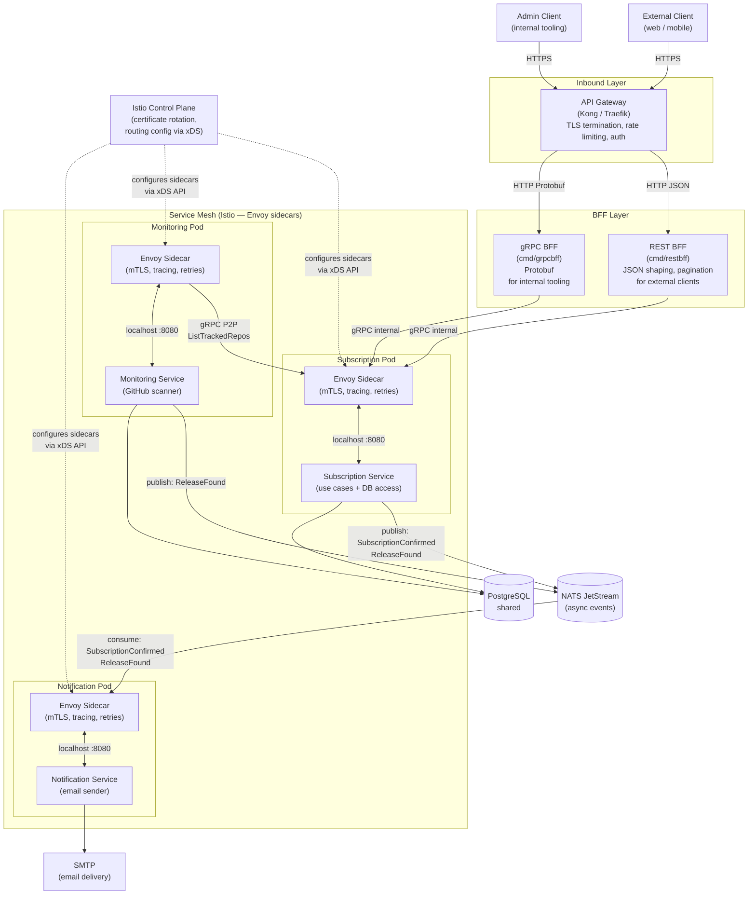
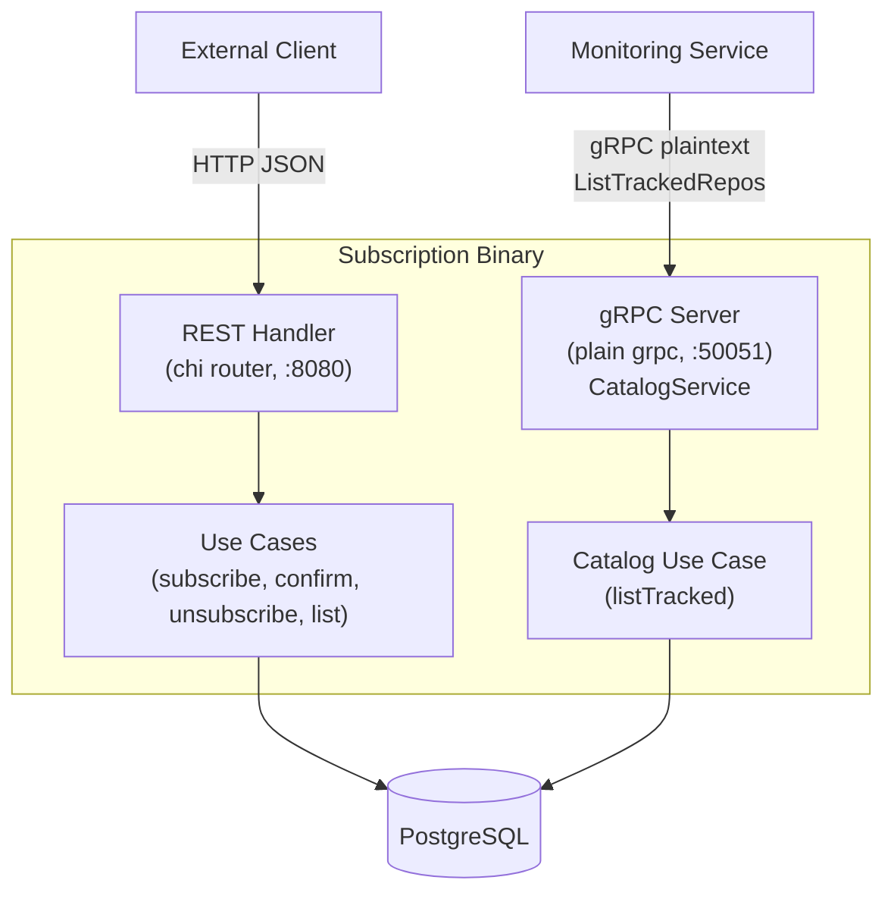
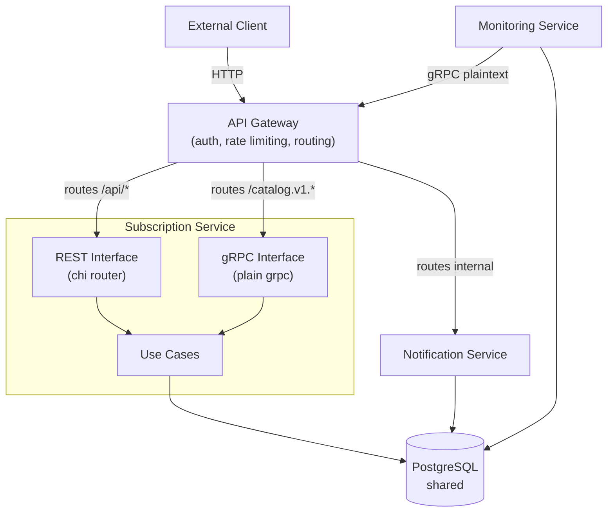
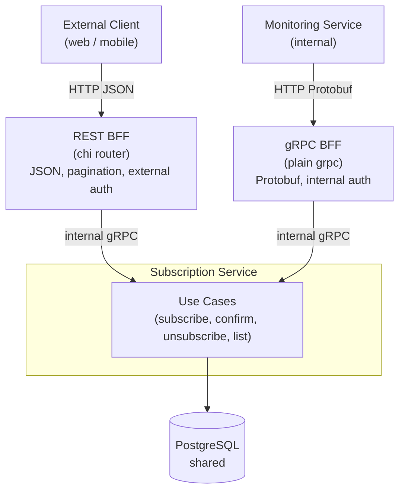
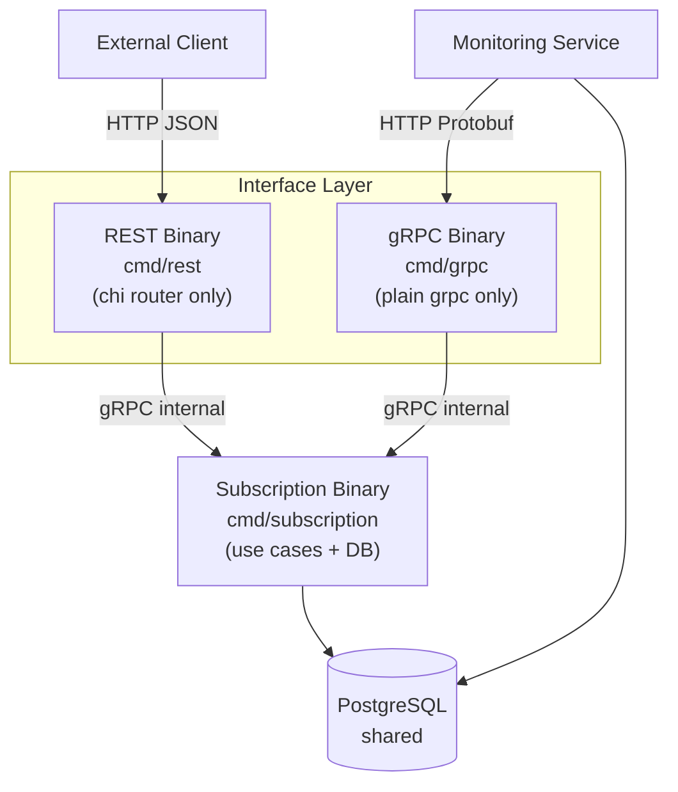
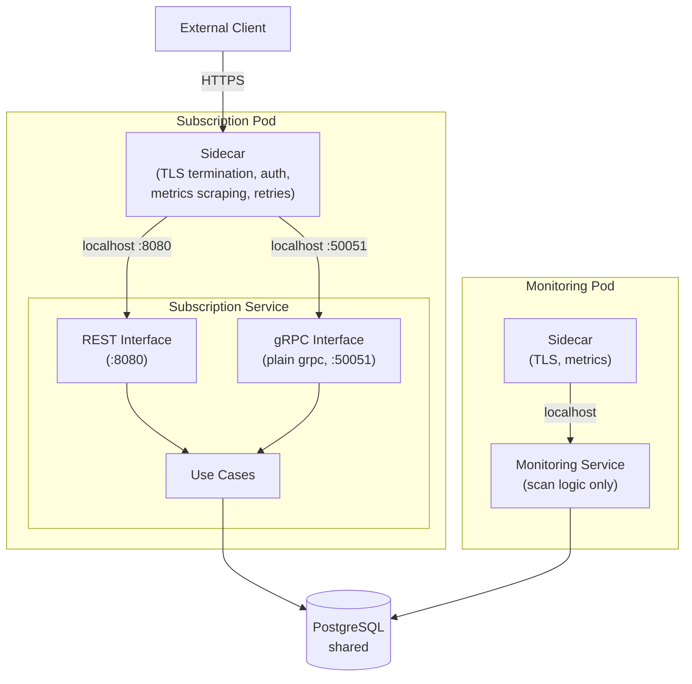
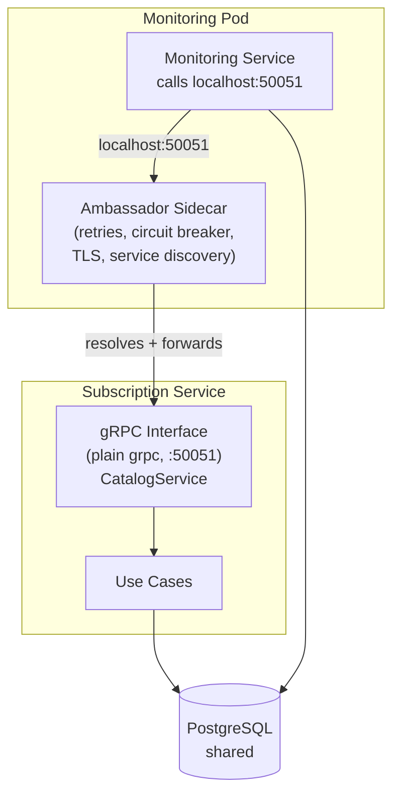

# Architecture Patterns

Diagrams showing how each pattern would look if applied to this system.
The current implementation uses none of these — they are reference designs for future scaling decisions.

---

## Target Architecture

Full production architecture combining API Gateway, BFFs, service mesh with sidecars, and mixed communication patterns.

### Communication types

| Path | Protocol | Pattern |
|---|---|---|
| External client → API Gateway | HTTPS | inbound |
| API Gateway → BFFs | HTTP/gRPC | inbound routing |
| BFFs → Subscription sidecar | gRPC | synchronous P2P |
| Monitoring → Subscription sidecar | gRPC | synchronous P2P |
| Subscription → NATS | publish | async event |
| Monitoring → NATS | publish | async event |
| NATS → Notification | consume | async event |
| All internal traffic | mTLS via Envoy | service mesh |

### Responsibilities per layer

**API Gateway** — TLS termination, rate limiting, auth validation, routing to the correct BFF.

**BFFs** — protocol and response shaping per client type. No business logic.

**Envoy sidecars** — mTLS between all internal services, distributed tracing headers, retries, circuit breaking. Transparent to application code.

**Istio control plane** — manages all sidecar config and certificate rotation centrally via xDS.

**NATS JetStream** — decouples subscription and monitoring from notification. Async, durable, guaranteed delivery.

---

## Current Architecture

One binary, two ports. REST on :8080 serves external clients. Internal-only CatalogService gRPC on :50051 serves monitoring with a single RPC. gRPC reaches only the catalog use case — no access to subscription operations.

---

## API Gateway

A single entry point handles cross-cutting concerns. The subscription service exposes both REST and gRPC interfaces internally — the gateway routes to each.

Auth middleware (`ApiKey` check) and rate limiting move out of the subscription service into the gateway. Both interfaces trust all inbound traffic as already authenticated.

---

## Backend for Frontend (BFF)

Each client type gets a dedicated interface binary shaped for its needs. Both forward to the same subscription service which owns the business logic.

The REST BFF handles pagination and response shaping for external consumers. The gRPC BFF is a thin pass-through optimised for monitoring's `ListTrackedRepos` call pattern. Neither contains business logic.

---

## Layered Decomposition

Interface, business logic, and persistence are independently deployable binaries. Each scales on its own bottleneck.

Interface binaries are stateless — scale horizontally freely. The subscription binary is also stateless (all state in PostgreSQL) so it scales independently. REST and gRPC interfaces deploy and scale separately from each other and from the business logic.

---

## Sidecar

A helper process runs alongside each service in the same pod. It handles infrastructure concerns so the service code stays pure business logic.

Auth and Prometheus metrics collection move into the sidecar. Both REST (:8080) and gRPC (:50051) interfaces are reachable through it. The subscription service has no knowledge of auth or observability infrastructure.

---

## Ambassador

A specific sidecar that proxies outbound calls from monitoring to the subscription gRPC interface. Handles retries, circuit breaking, and service discovery.

Instead of monitoring hardcoding `cfg.SubscriptionGRPCAddr` and managing retries itself, it dials `localhost:50051`. The ambassador resolves the real address of the subscription gRPC interface and handles all resilience concerns. If the service moves or is rebalanced, only the ambassador config changes — monitoring code is untouched.
